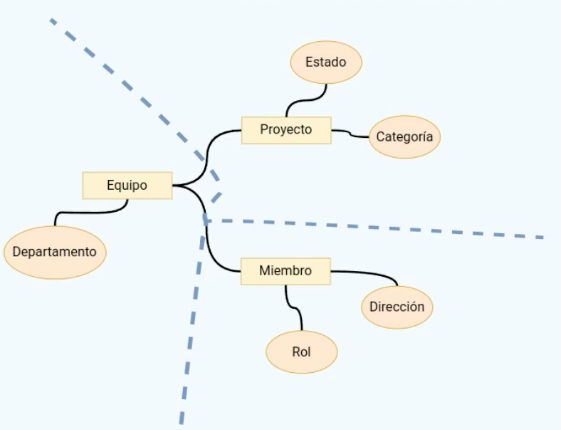

## DDD (Domain Design Drive).
Es la evolución de las arquitecturas convencionales de 1 o 3 capas.

__Las flechas indican el flujo de la información__, no la dependencia.
Es importante conseguir la __IoC__ usando técnicas como la __inyección
de dependencias.__

Estas capas se divide en las siguientes:

1. __Presentación:__ No sufre cambios con la arquitectura de 3 capas.
2. __Aplicación:__ Reside los casos de usos.
3. __Dominio:__ Reside toda la lógica del dominio del problema.
4. __Infraestructura:__ La capa de datos se ha renombrado a la capa
                        de infraestructura, ya que no se va a tratar
                        con datos sino con todo lo relacionado a la 
                        infraestructura de nuestro sistema (Datos, 
                        Framework, Logging, etc.).

__NOTA.__ La capa de lógica de negocio se dividió en 2 que seria la capa de
aplicación y la capa de dominio.

### Capa de presentación.
* API de entrada a nuestro sistema que da soporte a la interfaz de
  usuario.
* Es la fachada e interactúa con los servicios de aplicación para
  iniciar los casos de uso (Ej: Controladores).

### Capa de presentación.
* Encargada de __orquestar__ todos los __casos de uso__ necesarios
  para el funcionamiento del sistema.
* __Interactúa con el dominio__ para ejecutar su lógica especifica.
* __Interactúa con la infraestructura__ para la persistencia,
  Framework, Logging, etc.
* __Responde a la presentación__ con los datos formateados
  correctamente.

### Capa de dominio.
* __Datos y lógica central del nuestro sistema__, diseñada bajo los
  principios de DDD.
* Debe estar __lo más aislado posible del exterior__. Se comunica
  con la infraestructura si necesita algún aspecto como Logging.
* Este __no debe saber nada ni de casos de uso ni detalles de
  implementación__ como el Framework, la DB utilizada, etc. No le
  debe afectar ningún cambio en los detalles de implementación en
  específico.
* Se compone de entidades de dominio y servicios de dominio.
    1. __Entidades de dominio.__
        * Datos.
        * Lógica.
        * __NO__ son entidades de persistencia (__@Entity__ en 
          Spring).
    2. __Servicios de dominio.__
        * Lógica de dominio que no se pueda asignar a una entidad
          de dominio específica.
        * Siguen los principios del DDD.
        * __@Service__ en Spring.

### Capa de infraestructura.
* __Persistencia.__
  * Objetos de ORMs (@Entity etc).
  * Repositorios.
* __Detalles del Framework.__
  * Clases de configuración.
  * Arranque de la aplicación.
* __Otros aspectos de infraestructura.__
  * Logging.

### ¡Importante!
* Es importante que el __dominio sea lo más estable__ de nuestro
  sistema.
* Nunca debemos modificar nuestro dominio para adaptarlo al exterior,
  como ejemplo DB.
* En ese caso, lo apropiado es adaptar la capa de infraestructura.

### Elementos del modelo de dominio

* __Entidades.__
  * Clases con datos y comportamiento.
* __Value Objects.__
  * Clases con simplemente datos.
  * Sirven para representar de manera más clara los atributos de las
    entidades.
  * Deben ser __inmutables__.
* __Aggregates.__
  * Grupos de Entidades y Value Objects.
  * Separan conceptos diferentes de nuestro dominio.

Como normal general, la comunicación entre distintos aggregates se debe
hacer __a través de la raíz__ de los mismos. Una raíz no puede acceder
a otro elemento no raíz de un aggregate diferente.