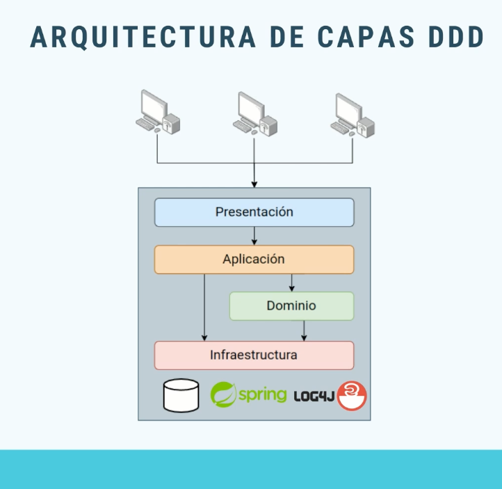

## DDD (Domain Design Drive).
Es la evolución de las arquitecturas convencionales de 1 o 3 capas.

Estas capas se divide en las siguientes:

1. __Presentación:__ No sufre cambios con la arquitectura de 3 capas.
2. __Aplicación:__ Reside los casos de usos.
3. __Dominio:__ Reside toda la lógica del dominio del problema.
4. __Infraestructura:__ La capa de datos se ha renombrado a la capa
                        de infraestructura, ya que no se va a tratar
                        con datos sino con todo lo relacionado a la 
                        infraestructura de nuestro sistema (Datos, 
                        Framework, Logging, etc).

__NOTA.__ La capa de lógica de negocio se dividió en 2 que seria la capa de
aplicación y la capa de dominio.

### Capa de presentación.
* API de entrada a nuestro sistema que da soporte a la interfaz de
  usuario.
* Es la fachada e interactúa con los servicios de aplicación para
  iniciar los casos de uso (Ej: Controladores).

### Capa de presentación.
* Encargada de __orquestar__ todos los __casos de uso__ necesarios
  para el funcionamiento del sistema.
* __Interactúa con el dominio__ para ejecutar su lógica especifica.
* __Interactúa con la infraestructura__ para la persistencia,
  Framework, Logging, etc.
* __Responde a la presentación__ con los datos formateados
  correctamente.

### Capa de dominio.
* __Datos y lógica central del nuestro sistema__, diseñada bajo los
  principios de DDD.
* Debe estar __lo más aislado posible del exterior__. Se comunica
  con la infraestructura si necesita algún aspecto como Logging.
* Este __no debe saber nada ni de casos de uso ni detalles de
  implementación__ como el Framework, la DB utilizada, etc. No le
  debe afectar ningún cambio en los detalles de implementación en
  específico.
* Se compone de entidades de dominio y servicios de dominio.
    1. __Entidades de dominio.__